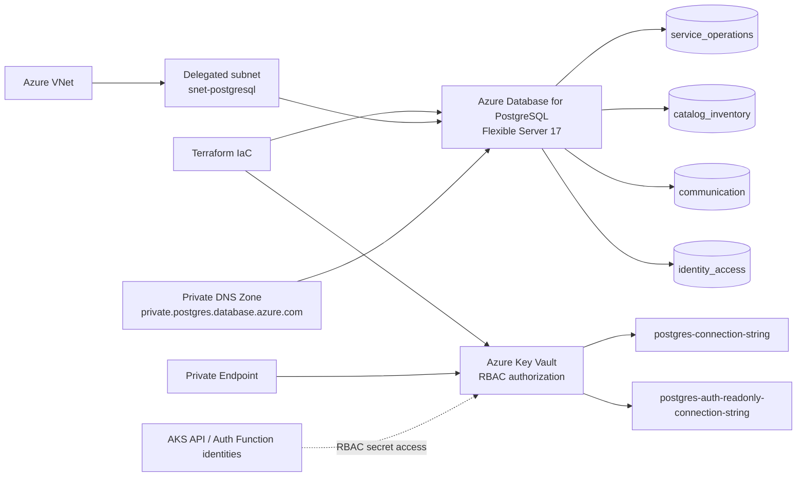

# CatCar - Database & Secrets Infrastructure (`catcar-database-infra`)

Terraform Infrastructure as Code (IaC) repository provisioning managed PostgreSQL Flexible Server, Azure Key Vault, Private DNS zones, and connection string secrets for the CatCar platform.

---

## Provisioned Infrastructure

- **Relational Database**: Azure Database for PostgreSQL Flexible Server with automated backups, custom storage configuration, and strict SSL enforcement.
- **Database Networking**: Delegated Subnet (`snet-postgresql`), Private DNS Zone (`private.postgres.database.azure.com`), and VNet Link to ensure isolated private communication.
- **Key Vault & Secrets**: Azure Key Vault with Azure RBAC authorization, Private Endpoint (`pe-kv-*`), Private DNS Zone (`privatelink.vaultcore.azure.net`), and automated secret storage for:
  - `postgres-connection-string`: Primary connection string for CatCar API.
  - `postgres-auth-readonly-connection-string`: Read-only connection string for CatCar Auth Function.
- **Cross-Stack Decoupling**: Dynamically discovers the private endpoint subnet (`snet-private-endpoints`) provisioned by `catcar-kubernetes-infra` via Terraform data sources without output dependencies.


## Dedicated Database Infrastructure Architecture



PostgreSQL traffic remains private through its delegated subnet and private DNS. Each bounded context uses an isolated schema, while Key Vault is reached through a private endpoint and authorizes managed identities with Azure RBAC rather than application-held credentials.

## API Health Checks & Postman

This infrastructure stack does not expose a business API; it provides the managed dependency verified by the platform readiness probe.

- **Readiness health check:** [http://localhost:5000/health/ready](http://localhost:5000/health/ready)
- **Liveness health check:** [http://localhost:5000/health/live](http://localhost:5000/health/live)
- **Swagger UI:** [http://localhost:5000/swagger](http://localhost:5000/swagger)
- **Versioned Postman collection:** [`CatCar_Platform.postman_collection.json`](https://github.com/RiseOn-CatCar/catcar-platform/blob/main/docs/postman/CatCar_Platform.postman_collection.json)
- **Postman environment template:** [`CatCar_Platform.postman_environment.json`](https://github.com/RiseOn-CatCar/catcar-platform/blob/main/docs/postman/CatCar_Platform.postman_environment.json)

Import the environment, set `baseUrl` to the deployed API endpoint, and run **Health & Observability → Readiness health check** to validate application-to-PostgreSQL connectivity without revealing a connection string.

---

## Repository Structure

```
.
├── main.tf                    # PostgreSQL Flexible Server, Key Vault, and DNS resources
├── variables.tf               # Input parameters and defaults
├── outputs.tf                 # Server FQDN, database ID, and Key Vault URI
└── .github/workflows/ci-cd.yml # Automated lint, validation, and multi-environment apply
```

---

## Local Validation

```bash
terraform init -backend=false
terraform fmt -check -recursive
terraform validate
```

---

## CI/CD Pipeline

- **Pull Requests**: Runs `terraform fmt` and `terraform validate`.
- **Push to `develop`**: Applies changes to **Homologation** environment with state key `homolog-catcar-database.tfstate`.
- **Push to `main`**: Applies changes to **Production** environment with state key `catcar-database.tfstate`.
